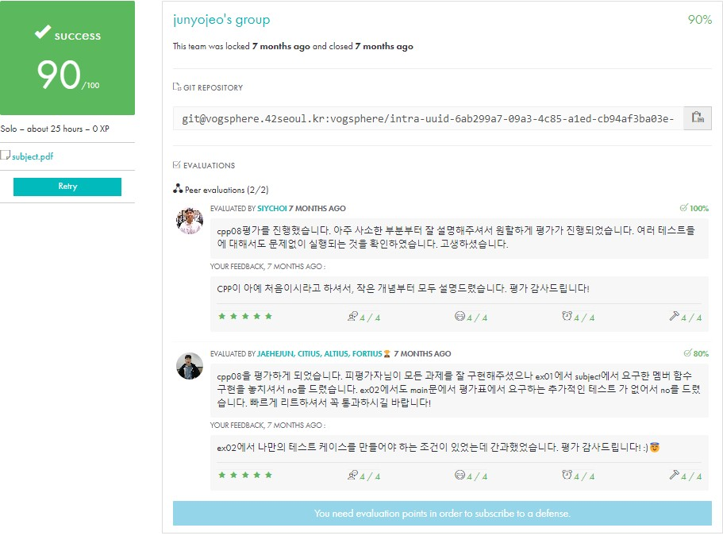

<div align="center">
  <h1>💻 CPP Module 08</h1>
  <p>STL | 템플릿 컨테이너와 알고리즘</p>

  
  
  <div>
    
    
  </div>

  ### 학습 내용
  - STL 컨테이너 활용 (vector, list, map)
  - STL 알고리즘 라이브러리 활용
  - 반복자(Iterator)
  - 함수 객체(Functor)
  - 템플릿 메타프로그래밍
</div>

## 🚀 Quick Start
```bash
make && ./easyfind
```

## 📋 목차
1. [개요](#-개요)
2. [구현 요구사항](#-구현-요구사항)
3. [STL 활용](#-stl-활용)
4. [테스트 방법](#-테스트-방법)
5. [주의사항](#-주의사항)
6. [평가 준비](#-평가-준비)

## 🎯 개요
> STL 컨테이너와 알고리즘을 활용하는 프로젝트입니다.

### 프로젝트 구조
```
📦 CPP-Module-08
 ├── 📜 ex00/
 │   ├── easyfind.hpp    # 컨테이너 내 요소 찾기
 │   └── main.cpp
 ├── 📜 ex01/
 │   ├── Span.hpp        # 숫자 저장 및 계산
 │   ├── Span.cpp
 │   └── main.cpp
 └── 📜 ex02/
     ├── MutantStack.hpp # stack 확장
     └── main.cpp
```

## 💡 구현 요구사항
> STL과 템플릿을 활용한 효율적인 구현이 필요합니다.

### ex00: easyfind
```cpp
// 첫 번째 발견된 요소의 반복자를 반환하는 함수 템플릿
template <typename T>
typename T::iterator easyfind(T& container, int value);

// 구현 예시
template <typename T>
typename T::iterator easyfind(T& container, int value) {
    return std::find(container.begin(), container.end(), value);
}
```

### ex01: Span
```cpp
class Span {
private:
    unsigned int _N;
    std::vector<int> _numbers;

public:
    // Orthodox Canonical Form
    Span(unsigned int N);
    Span(const Span& other);
    ~Span();
    Span& operator=(const Span& other);

    // Member functions
    void addNumber(int number);
    int shortestSpan();
    int longestSpan();
    
    // 범위 추가 기능
    template <typename Iterator>
    void addRange(Iterator begin, Iterator end);
};
```

### ex02: MutantStack
```cpp
template <typename T>
class MutantStack : public std::stack<T> {
public:
    // iterator 타입 정의
    typedef typename std::stack<T>::container_type::iterator iterator;
    typedef typename std::stack<T>::container_type::const_iterator const_iterator;
    
    // iterator 관련 메서드
    iterator begin() { return this->c.begin(); }
    iterator end() { return this->c.end(); }
    const_iterator begin() const { return this->c.begin(); }
    const_iterator end() const { return this->c.end(); }
};
```

## 🔄 STL 활용
> STL의 주요 컴포넌트들을 효과적으로 활용합니다.

### 1. 컨테이너
```cpp
// vector: 동적 배열
std::vector<int> vec;
vec.push_back(42);
vec.push_back(21);

// list: 양방향 연결 리스트
std::list<int> lst;
lst.push_back(42);
lst.push_front(21);

// stack: LIFO 구조
std::stack<int> stk;
stk.push(42);
stk.top();  // 최상위 요소 접근
```

### 2. 알고리즘
```cpp
// find: 요소 검색
std::vector<int>::iterator it = std::find(vec.begin(), vec.end(), 42);

// sort: 정렬
std::sort(vec.begin(), vec.end());

// min_element/max_element: 최소/최대 요소
int min = *std::min_element(vec.begin(), vec.end());
int max = *std::max_element(vec.begin(), vec.end());

// distance: 반복자 간 거리
int dist = std::distance(vec.begin(), it);
```

### 3. 반복자 활용
```cpp
// 기본 순회
for (std::vector<int>::iterator it = vec.begin(); it != vec.end(); ++it) {
    std::cout << *it << " ";
}

// 역방향 순회
for (std::vector<int>::reverse_iterator rit = vec.rbegin(); 
     rit != vec.rend(); ++rit) {
    std::cout << *rit << " ";
}

// 범위 기반 삽입
template <typename Iterator>
void addRange(Iterator begin, Iterator end) {
    _numbers.insert(_numbers.end(), begin, end);
}
```

### 4. 예외 처리
```cpp
class Span {
public:
    class FullSpanException : public std::exception {
        const char* what() const throw() {
            return "Span is full";
        }
    };
    
    class NoSpanException : public std::exception {
        const char* what() const throw() {
            return "No span can be found";
        }
    };
};
```

## 🔍 테스트 방법
> 각 exercise별 테스트를 수행합니다.

### ex00: easyfind
```cpp
int main() {
    // vector 테스트
    std::vector<int> numbers;
    numbers.push_back(1);
    numbers.push_back(2);
    numbers.push_back(3);
    numbers.push_back(4);
    numbers.push_back(5);

    try {
        // 존재하는 값 찾기
        std::vector<int>::iterator it = easyfind(numbers, 3);
        std::cout << "Found: " << *it << std::endl;

        // 존재하지 않는 값 찾기
        it = easyfind(numbers, 42);
        std::cout << "Found: " << *it << std::endl;
    }
    catch (const std::exception& e) {
        std::cout << "Not found" << std::endl;
    }
}
```

#### 실행 결과
```bash
Found: 3
Not found
```

### ex01: Span
```cpp
int main() {
    try {
        Span sp = Span(5);
        sp.addNumber(6);
        sp.addNumber(3);
        sp.addNumber(17);
        sp.addNumber(9);
        sp.addNumber(11);

        std::cout << "Shortest span: " << sp.shortestSpan() << std::endl;
        std::cout << "Longest span: " << sp.longestSpan() << std::endl;

        // 범위 추가 테스트
        std::vector<int> vec;
        for (int i = 0; i < 10000; i++)
            vec.push_back(i);

        Span bigSpan(10000);
        bigSpan.addRange(vec.begin(), vec.end());
    }
    catch (const std::exception& e) {
        std::cout << e.what() << std::endl;
    }
}
```

#### 실행 결과
```bash
Shortest span: 2
Longest span: 14
```

### ex02: MutantStack
```cpp
int main() {
    MutantStack<int> mstack;
    
    mstack.push(5);
    mstack.push(17);
    
    std::cout << "Top: " << mstack.top() << std::endl;
    mstack.pop();
    std::cout << "Size: " << mstack.size() << std::endl;
    
    // 반복자 테스트
    for (int i = 0; i < 5; i++)
        mstack.push(i);
        
    MutantStack<int>::iterator it = mstack.begin();
    MutantStack<int>::iterator ite = mstack.end();
    
    while (it != ite) {
        std::cout << *it << " ";
        ++it;
    }
    std::cout << std::endl;
}
```

#### 실행 결과
```bash
Top: 17
Size: 1
5 0 1 2 3 4
```

## ⚠️ 주의사항
> STL 사용 시 반드시 확인해야 할 사항들입니다.

### 1. 반복자 무효화
```cpp
// ❌ 잘못된 사용
std::vector<int> vec;
vec.push_back(1);
std::vector<int>::iterator it = vec.begin();
vec.push_back(2);  // 재할당으로 인해 it가 무효화됨
*it = 42;  // 미정의 동작!

// ✅ 올바른 사용
std::vector<int> vec;
vec.reserve(2);  // 미리 공간 확보
vec.push_back(1);
std::vector<int>::iterator it = vec.begin();
vec.push_back(2);  // 재할당 발생하지 않음
```

### 2. 범위 검사
```cpp
class Span {
public:
    void addNumber(int number) {
        if (_numbers.size() >= _N)
            throw FullSpanException();
        _numbers.push_back(number);
    }
    
    int shortestSpan() {
        if (_numbers.size() < 2)
            throw NoSpanException();
        // ... 구현 ...
    }
};
```

### 3. 메모리 관리
```cpp
// 컨테이너 비우기
void clear() {
    _numbers.clear();  // 벡터 내용 삭제
    // _numbers.shrink_to_fit();  // C++11
}

// 깊은 복사 보장
Span& operator=(const Span& other) {
    if (this != &other) {
        _N = other._N;
        _numbers = other._numbers;  // vector는 자동으로 깊은 복사
    }
    return *this;
}
```

### 4. 알고리즘 복잡도
```cpp
// 비효율적인 구현
int shortestSpan() {
    std::vector<int> sorted(_numbers);
    std::sort(sorted.begin(), sorted.end());  // O(n log n)
    
    int minSpan = INT_MAX;
    for (size_t i = 1; i < sorted.size(); ++i) {
        int span = sorted[i] - sorted[i-1];
        minSpan = std::min(minSpan, span);
    }
    return minSpan;
}
```

## ✅ 평가 준비
> 평가 시 확인하는 핵심 사항들입니다.

### 1. 기본 요구사항
| 항목 | 설명 | 확인 |
|-----|------|------|
| 컴파일 | C++ 98 표준 준수 | ⬜ |
| STL | 적절한 컨테이너/알고리즘 선택 | ⬜ |
| 예외 처리 | 범위 검사 및 에러 처리 | ⬜ |
| 메모리 | 누수 없음 | ⬜ |

### 2. Exercise별 체크리스트

#### ex00: easyfind
- [ ] 템플릿 함수 구현
  ```cpp
  std::vector<int> v;
  easyfind(v, 42);  // 컴파일 성공
  std::list<int> l;
  easyfind(l, 42);  // 컴파일 성공
  ```
- [ ] 요소를 찾지 못할 경우 예외 처리
- [ ] STL 알고리즘 활용

#### ex01: Span
- [ ] 모든 멤버 함수 구현
  - addNumber
  - shortestSpan
  - longestSpan
  - addRange
- [ ] 대량의 숫자 처리 가능
- [ ] 예외 처리 구현

#### ex02: MutantStack
- [ ] std::stack 상속
- [ ] 반복자 구현
  ```cpp
  MutantStack<int> mstack;
  for (MutantStack<int>::iterator it = mstack.begin();
       it != mstack.end(); ++it) {
      // 정상 작동
  }
  ```
- [ ] list와 동일한 동작 확인

### 3. 평가 대비 질문
```cpp
// Q: STL 컨테이너의 종류와 특징은?
A: vector - 동적 배열, 빠른 임의 접근
   list - 양방향 연결 리스트, 빠른 삽입/삭제
   stack - LIFO 구조, 제한된 인터페이스

// Q: 반복자 카테고리의 차이점은?
A: Input Iterator - 단방향 읽기
   Forward Iterator - 단방향 읽기/쓰기
   Bidirectional Iterator - 양방향 읽기/쓰기
   Random Access Iterator - 임의 접근

// Q: vector vs list 언제 사용?
A: vector - 빈번한 접근, 끝에서의 삽입/삭제
   list - 빈번한 중간 삽입/삭제
```

## 📚 참고자료
### STL 컨테이너
- [C++ Reference - Containers](https://en.cppreference.com/w/cpp/container)
  - [vector](https://en.cppreference.com/w/cpp/container/vector)
  - [list](https://en.cppreference.com/w/cpp/container/list)
  - [stack](https://en.cppreference.com/w/cpp/container/stack)

### STL 알고리즘
```cpp
// 주요 알고리즘 예제
#include <algorithm>

// 검색
std::find(v.begin(), v.end(), value);
std::find_if(v.begin(), v.end(), predicate);

// 정렬
std::sort(v.begin(), v.end());
std::sort(v.begin(), v.end(), compare);

// 수치 알고리즘
std::min_element(v.begin(), v.end());
std::max_element(v.begin(), v.end());
std::accumulate(v.begin(), v.end(), 0);
```

### 반복자
```cpp
// 반복자 종류별 예제
// 1. Input Iterator
std::istream_iterator<int> in_it(std::cin);

// 2. Output Iterator
std::ostream_iterator<int> out_it(std::cout, " ");

// 3. Forward Iterator
std::forward_list<int>::iterator fwd_it;

// 4. Bidirectional Iterator
std::list<int>::iterator bi_it;

// 5. Random Access Iterator
std::vector<int>::iterator ra_it;
```

### 온라인 컴파일러
- [C++ Shell](http://cpp.sh/)
  - 온라인 C++ 컴파일러
- [Quick Bench](https://quick-bench.com/)
  - 컨테이너 성능 비교
- [Compiler Explorer](https://godbolt.org/)
  - 최적화 결과 분석